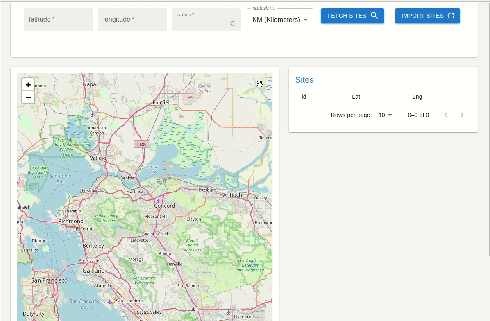
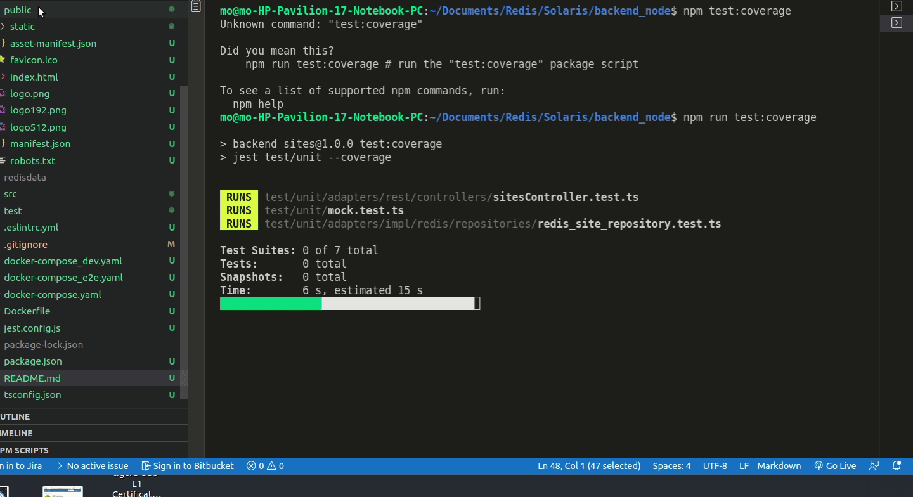
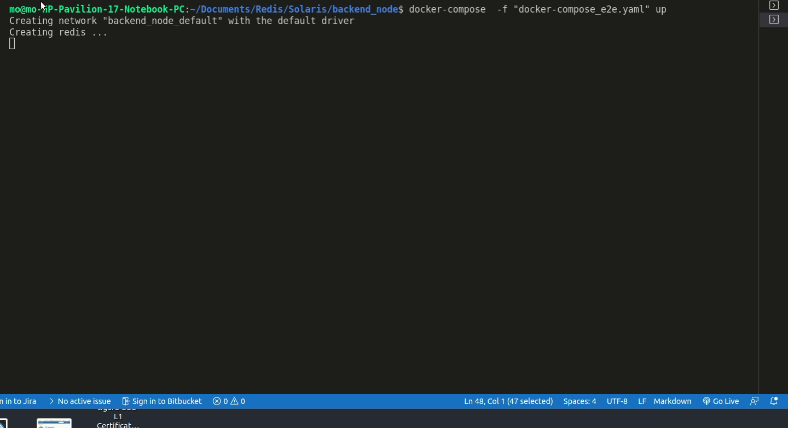

## Summary
API doing TDD in Node with Typescript (and Jest) plus demo GUI using React Front-end 



## Tech

used a number of open source projects to work properly:

- [TyepeScript] - typechecker
- [node.js]     - runtime for the backend
- [jest]        -framework for tests
- [Express]     - fast node.js  app framework 
- [Redis]       - NoSQl DataStorage
- [React]       -demo front-end

## Requirement 
- [docker-compose] version 1.2+
- [node]  v14.+

## Development

Open your favorite Terminal and run these commands.
First deploy redis in a Docker container (port 6379):
```sh

docker-compose -f "docker-compose_dev.yaml" up -d
```
Insall Dependencies
```sh
npm install
```

than run loacl tests :


```sh
npm test
```
tests with coverage:

```sh
npm run test:coverage
```



e2e tests local developement 
```sh
NODE_ENV=dev npm run test:e2e
```
serve app demo :

```sh
npm start
```
open your favorite Browser at http://localhost:3000/

## Testing
For e2e testing  open your favorite Terminal and run these commands.
```sh
docker-compose -f "docker-compose_dev.yaml" down (if up)
docker-compose  -f "docker-compose_e2e.yaml" up
```

## Setup with docker-compose 
run with docker-compose
```sh
docker-compose up -d
```
Open your favorite Browser at http://localhost:3000/


